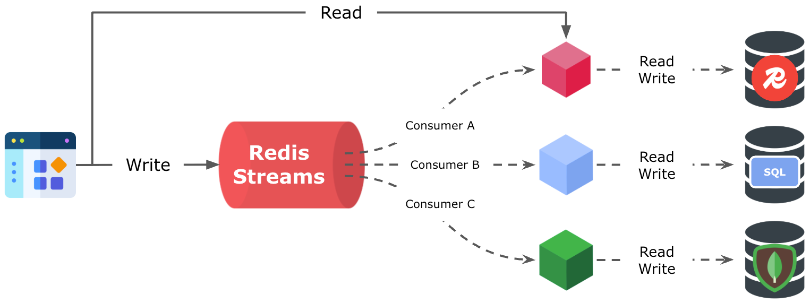

[](https://search.maven.org/artifact/io.github.foogaro/kinexis-core)

# Kinexis

Kinexis. Implementing The Caching Patterns The Right Way. Write Once. Reflect Instantly. Rediscover Effortlessly.

## Introduction

The name **Kinexis** is a coined term, created by merging the words **Kinesis** (movement, flow) and **Nexus** (connection, link).
It reflects the library’s core purpose: managing the **flow of data** between systems through **connected, reliable caching patterns**.

The Kinexis library offers a powerful and efficient implementation of the most common used caching pattern, specifically designed to support high-performance applications that require rapid data access and consistency across cache and database layers. By handling cache updates and synchronizing them with the underlying database in the background, this library ensures that data remains current and consistent without compromising application speed or responsiveness. This streamlined approach simplifies data management, making it ideal for applications with demanding performance and scalability requirements.

## Most Common Caching Patterns

### Cache-Aside (Lazy-loading)

In the Cache-Aside pattern, the application controls how data is loaded into the cache.

When a request is made, the application first checks if the data is present in the cache.

* **If the data is found**, it is returned immediately.
* **If the data is not found**, the application retrieves it from the database, stores it in the cache for future requests, and then returns it to the requester.

### Read-Through

In the Read-Through pattern, the application retrieves data exclusively through the caching layer, without accessing the database directly.

When the application requests data, it queries the cache.

* **If the data is present**, the cache returns it immediately.
* **If the data is missing**, the cache loads it from the underlying data source (e.g., a database), stores it for future access, and returns it to the application.

This pattern offloads the responsibility of cache population to the caching system, keeping the application logic simple and consistent.

### Write-Through
The Write-Through pattern defines how data should be written when using a cache.

In this pattern, the application writes data **only to the cache**, never directly to the underlying data store.

* When the application sends a write request, the caching layer stores the data **and** immediately forwards it to the backing data source (such as a database).
* Both operations happen synchronously, ensuring the cache and the data store remain consistent.

This pattern simplifies application logic and guarantees that the cache always contains up-to-date data.

### Write-Behind (Write-back)
The Write-Behind pattern defines how data is written when using a cache with deferred persistence.

In this pattern, the application writes data **only to the cache**, without interacting directly with the underlying data store.

* When the application sends a write request, the caching layer stores the data immediately.
* The cache then forwards the data to the backing data source **asynchronously**, at a later time.

This decoupling improves write performance and reduces latency, but introduces a risk of data loss if the cache fails before the data is persisted.

### Refresh-Ahead (Read-Ahead)
The Refresh-Ahead strategy preemptively updates cached data **before it expires**, ensuring that fresh data is always available.

Instead of waiting for a request to trigger a refresh, the caching layer **asynchronously** refreshes data in the background just before it becomes stale.

* This approach helps maintain low-latency responses for end-users, even when the underlying data needs to be updated.
* It also reduces the risk of a **cache stampede**, where many concurrent requests trigger a costly refresh for the same expired data.

### Read-Replica
The Read-Replica pattern describes how data can be automatically updated from the primary data source to the caching layer to serve read-only queries.

In database systems, a *read replica* is a copy of the primary database used exclusively for read operations (e.g., `SELECT` queries). It helps distribute read traffic and improve performance and scalability by offloading work from the primary database.

A caching layer can act as a read replica by automatically synchronizing data from the primary data store.

* This setup enhances throughput for read-heavy workloads while reducing the load on the main database.
* Synchronization is typically **asynchronous**, meaning there may be a short delay before changes in the primary source appear in the replica (the cache).

Despite this slight lag, the benefits in read performance and horizontal scalability often outweigh the trade-off in consistency.

## Kinexis Caching Patterns
Not all caching systems provide built-in mechanisms to connect directly to a database for reading or writing data. For example, Redis previously offered a module called **RedisGears**, which allowed developers to deploy Java or Python code that could be triggered by specific events and executed either synchronously or asynchronously.

However, **RedisGears was deprecated** because it relied on Redis's **Pub/Sub notification system**, which does not guarantee message delivery. This meant that, under certain conditions, a write operation could be triggered in Redis but **never reach the database**, leading to **silent inconsistencies** without any built-in detection or recovery.

**Kinexis**is a lightweight yet powerful library that enables developers to implement widely used caching patterns directly at the application level, without relying on custom modules or specialized infrastructure within the caching system. With **just a few lines of code**, Kinexis makes it easy to apply caching strategies in a consistent, reliable, and maintainable way across different parts of an application.

Kinexis is built on top of **Redis** and integrates seamlessly with the Java ecosystem, leveraging popular clients such as **Lettuce**, **Jedis**, and **Spring Data Redis**. This allows developers to adopt Kinexis within existing projects with minimal friction, while taking advantage of the flexibility and performance of Redis as the underlying cache.

Currently, Kinexis supports three core caching patterns:

* **Cache-Aside**: For lazy-loading data into the cache when it's missing.
* **Write-Behind**: For deferring writes to the underlying data store, improving performance through asynchronous persistence.
* **Refresh-Ahead**: For preemptively refreshing data before it expires, ensuring consistently low-latency reads.

By handling the complexity of these patterns internally, Kinexis helps reduce boilerplate code, minimize the risk of subtle bugs, and enhance the scalability and responsiveness of data-driven applications.

## How Kinexis Works

The reliability promise of Kinexis is rooted in its use of **Redis Streams** combined with Redis's **persistence mechanisms**, which ensure that no data is lost.
Every write operation goes first into a Redis Stream, making it durable and traceable. From there, the actual data is created and stored in a structured format such as a **Redis Hash** or **Redis JSON**, ready to be queried and mapped to application-level objects.

Here is the high level architecture diagram:

<p align="center"></p>


From a developer’s perspective, Kinexis is intentionally simple and non-intrusive. It revolves around three key components:

* A single annotation: `@CachingPatterns`
* Two enums: `CachingPattern` and `CachingFormat`
* One core service: `KinexisService`

Everything else is handled internally by the library, abstracting away complexity while maintaining full control and flexibility.

In a typical Spring Boot microservice, Kinexis fits naturally into the standard application structure. You define your entity, expose it through a REST API, and implement a service and repository layer. That’s all you need to get started with Kinexis in its most basic form—no custom infrastructure or verbose configuration required.

### Let’s See It in Practice

To understand how Kinexis integrates into a real-world application, consider a typical **Spring Boot** project structure. Kinexis is designed to work seamlessly within this familiar layout, requiring minimal changes to your existing codebase.

Here’s an example of a standard project structure:

```
src/
└── main/
    └── java/
        └── com/
            └── example/
                ├── controller/
                │   └── EmployerController.java
                ├── entity/
                │   └── Employer.java
                ├── repository/
                │   └── EmployerRepository.java
                ├── service/
                │   └── EmployerService.java
                └── KinexisApplication.java
```

In this structure:

* `EmployerController` exposes REST endpoints.
* `EmployerService` contains business logic.
* `EmployerRepository` handles data access.
* `Employer` is the domain entity.
* `KinexisApplication` is the Spring Boot Application.

By simply annotating your service or entity with `@CachingPatterns` and specifying your desired `CachingPattern` and `CachingFormat`, Kinexis activates the caching logic without further intervention.

The `Employer` entity is defined as follows:

```java
@Entity
@Table(name = "employers")
@CachingPatterns(
        format = CachingFormat.JSON, 
        patterns = {CachingPattern.WRITE_BEHIND, 
                CachingPattern.CACHE_ASIDE, 
                CachingPattern.REFRESH_AHEAD}
)
public class Employer {

    @Id
    private Long id;

    @Column(name = "name", nullable = false)
    private String name;

    @Column(name = "address", nullable = false)
    private String address;

    @Column(name = "email", unique = true, nullable = false)
    private String email;

    @Column(name = "phone", nullable = true)
    private String phone;

    public Employer() {
    }
}
```

For this entity, **Kinexis** will automatically apply the **Cache-Aside**, **Write-Behind**, and **Refresh-Ahead** caching patterns, as declared by the `@CachingPatterns` annotation on the `Employer` class.
The entity will be stored in **Redis** using the **JSON format**, enabling efficient storage, querying, and mapping to the domain model.

In a typical Spring Boot application, the structure remains clean and layered:

```
Controller → Service → Repository → Database
                 ↓
             Kinexis (Cache Layer)
```

* The **controller** exposes HTTP endpoints (e.g., using `@GetMapping`, `@PostMapping`).
* The **service** layer delegates read and write operations to **Kinexis**, which handles caching transparently.
* The **repository** provides access to the database using Spring Data JPA, and is used internally by Kinexis.
* **Kinexis** intercepts reads and writes to apply caching behavior, using Redis Streams and Redis JSON under the hood.


The service layer with `EmployerService` is defined as follows:

```java
@Service
public class EmployerService extends KinexisService<Employer> {

    private final EmployerRepository repository;

    public EmployerService(EmployerRepository repository) {
        this.repository = repository;
    }

    public List<Employer> findAll() {
        return repository.findAll();
    }

    public Employer getEmployerByEmail(String email) {
        return repository.findByEmail(email);
    }
}
```

By extending `KinexisService<Employer>`, the service class automatically inherits all Kinexis caching capabilities (e.g. `read`, `write`, `delete`) tied to the `Employer` entity.

The `EmployerRepository` is still used directly for queries that fall outside Kinexis-managed flows, such as `findAll()` or lookups by non-ID fields (`findByEmail()`), and is defined as follows:


```java
@Repository
public interface EmployerRepository extends JpaRepository<Employer, Long> {

    Employer findByEmail(String email);

}
```

The repository is a standard **Spring Data JPA** interface used to interact with the underlying relational database.
It is used both by the application directly (for custom queries) and by **Kinexis internally** for persistence and refresh operations.

Highlights:
* `JpaRepository<Employer, Long>` provides built-in CRUD operations.
* The custom method `findByEmail(String email)` allows querying by a unique field.
* Kinexis automatically uses this repository behind the scenes when persisting data (e.g., during write-behind or refresh-ahead operations), so there’s no need to add special logic for integration.

### That's It — Kinexis Takes Care of the Rest

With the entity, repository, and service layers in place, there's nothing more you need to do.
The **Kinexis library** automatically handles all caching behavior according to the patterns declared on your entity:

* **Cache-Aside** for efficient read-through logic with fallback to the database
* **Write-Behind** for high-performance, asynchronous persistence
* **Refresh-Ahead** to keep data fresh and prevent cache stampedes
* All stored in **Redis** using the **Hash** or **JSON** format for easy mapping and querying

You don’t need to write extra caching code, manage Redis keys manually, or worry about consistency logic. Kinexis integrates seamlessly into your existing Spring Boot architecture, so your application stays clean, modular, and scalable.

> From here, the controller simply delegates to the service layer, and Kinexis handles the rest—reliably and transparently.

# Disclaimer

Kinexis is a personal project and is **not affiliated with or endorsed by Redis Inc.** in any way.
It is an independent library that leverages **Redis** as a caching and streaming technology to implement well-known caching patterns such as Cache-Aside, Write-Behind, and Refresh-Ahead.
