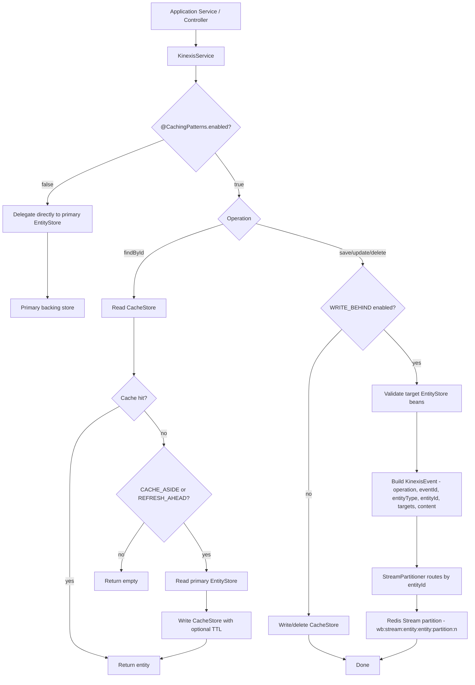
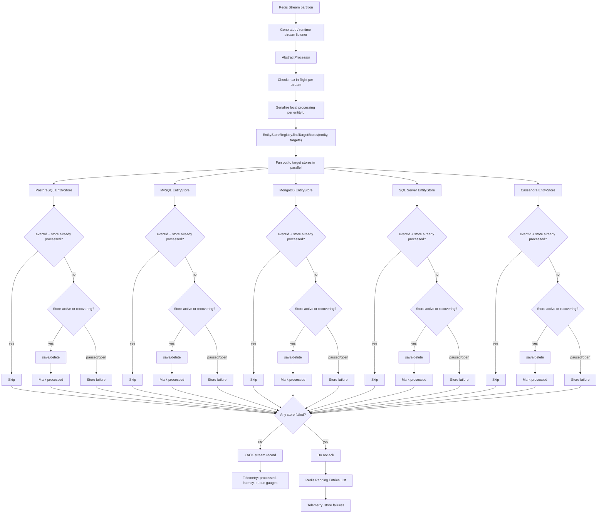
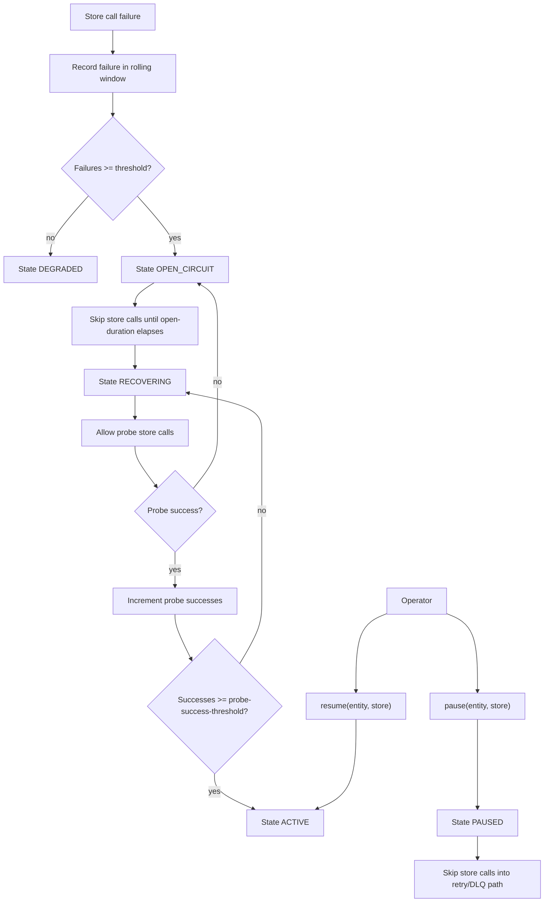
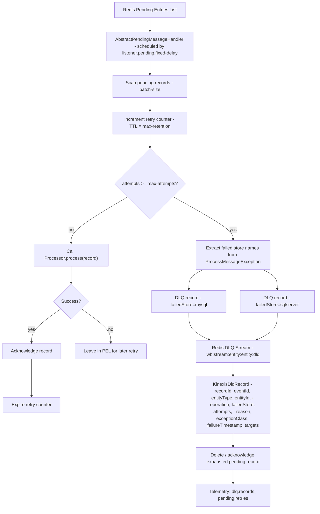
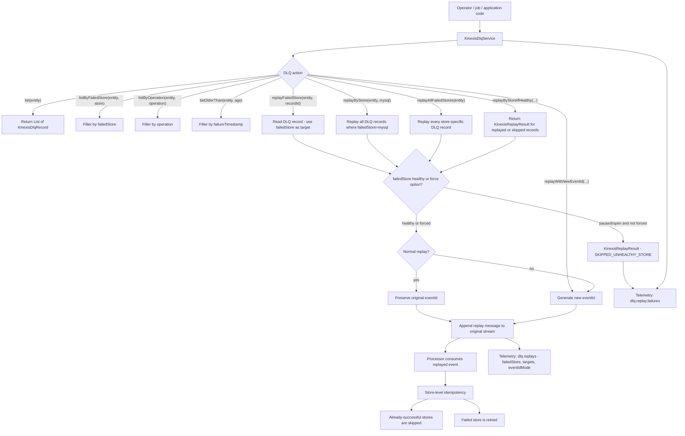
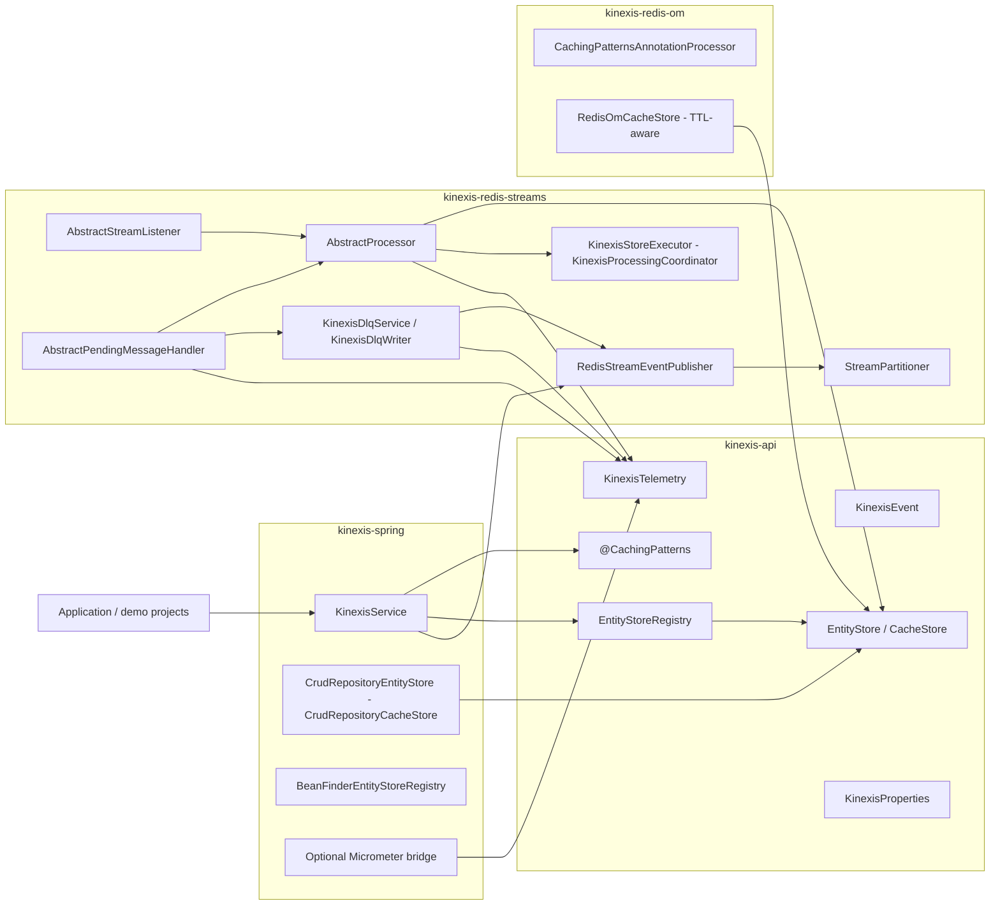
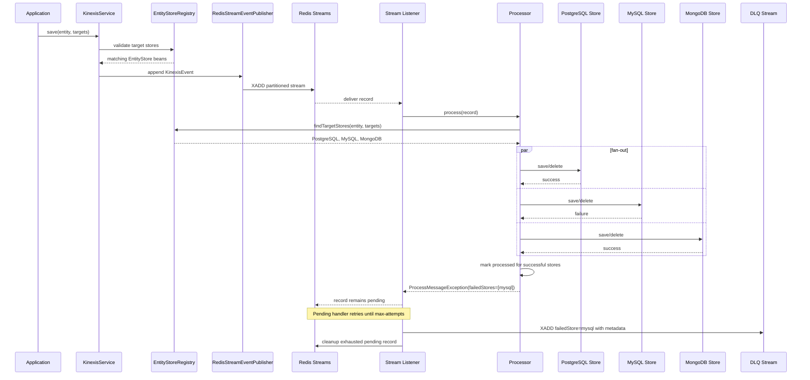
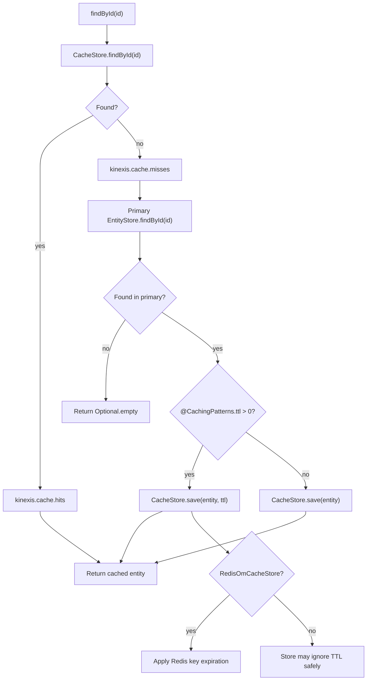

# Kinexis Workflows

This document describes the main Kinexis runtime flows using Mermaid diagrams.

## Service Entry Flow

## Write-Behind Processing Flow

## Store Health Flow

## Pending Retry And Per-Store DLQ Flow

## DLQ Listing And Replay Flow

## Module Boundary Flow

## Write-Behind Failure Sequence

## Cache-Aside And TTL Flow

